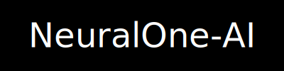

  

> Explorando inteligência artificial com autonomia, curiosidade e propósito.

---

## Estatísticas do GitHub

---

## 📈 Score de Progresso (em tempo real)

| Projeto          | Descrição                                   | Última atualização           | Status      |
|------------------|----------------------------------------------|-------------------------------|-------------|
| [**Quantum**](https://github.com/NeuralOne-AI/Quantum)       | Núcleo de IA adaptativa        |  |  |
| [**VisionX**](https://github.com/NeuralOne-AI/VisionX)       | Visão computacional            |  |  |
| [**SynapseCore**](https://github.com/NeuralOne-AI/SynapseCore) | Framework neural customizado   |  |  |

---

## Linguagens e Métricas Avançadas

> Para ativar este SVG, configure o [Metrics](https://github.com/lowlighter/metrics) com GitHub Actions no seu repositório.

---

## Contato & Redes Sociais

---

## Status

- Repositórios em construção  
- Estudo profundo de arquitetura Transformer, Cython, C++ e R 

---
